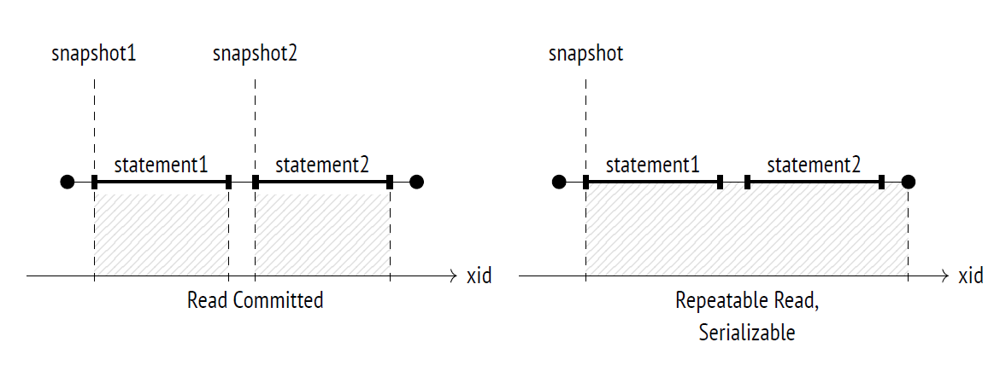
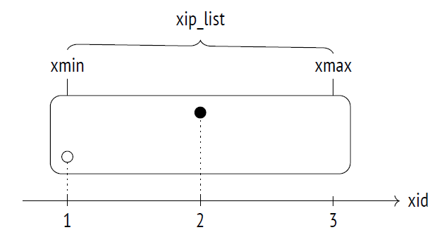

# What is snapshot
Visible versions of all the different rows constitute a **snapshot**. It means that different transactions can see different snapshots taken at different points in time, which are nevertheless consistent.

At the ***Read Committed*** isolation level, a snapshot is taken at the beginning of each statement, and it remains active only for the duration of this statement. 
At the ***Repeatable Read and Serializable*** levels, a snapshot is taken at the beginning of the first statement of a transaction, and it remains active until the whole transaction is complete.



## Snapshot Structure
a snapshot consists of several values saved at the time of its creation :

1. ***xmin*** is the snapshot’s lower boundary, which is represented by the 􀔥􀔠 of the oldest active transaction. All the transactions with smaller 􀔥􀔠s are either committed (so their changes are included into the snapshot) or aborted (so their changes are ignored).

2. ***xmax*** is the snapshot’s upper boundary, which is represented by the value that exceeds the 􀔥􀔠 of the latest committed transaction by one. The upper boundary defines the moment when the snapshot was taken. All the transactions whose 􀔥􀔠s are equal to or greater than xmax are either still
running or do not exist, so their changes cannot be visible.

3. ***xip_list*** is the list of IDs of all the active transactions except for virtual ones, which
do not affect visibility in any way.

Graphical form - 



``` sql
SELECT * FROM heap_page('accounts',0);

SELECT backend_xmin FROM pg_stat_activity
WHERE pid = pg_backend_pid();
```

Note - 
Commit times can be tracked if you enable the ***track_commit_timestamp*** parameter, but they do not participate in visibility checks in any way (although it can still be useful to track them for other purposes, for example, to apply in external replication solutions).

Besides, PostgreSQL always logs commit and rollback times in the corresponding WAL entries, but this information is used only for point-in-time recovery.

# References from book reading google group
1. [PgSQL Transaction Isolation](https://www.postgresql.org/docs/14/transaction-iso.html)
2. [A beginner’s guide to Read and Write Skew phenomena](https://vladmihalcea.com/a-beginners-guide-to-read-and-write-skew-phenomena/)
3. [Transaction Isolation in Postgres](https://medium.com/@darora8/transaction-isolation-in-postgres-ec4d34a65462)
4. [Mastering PostgreSQL: An Engineer’s Guide to Isolation Levels](https://medium.com/@golang.learner.amazing/mastering-postgresql-an-engineers-guide-to-isolation-levels-8b8b2ad65b3f)
5. [ Franck Pachot's 13-part blog series that digs deeper into isolation level](https://dev.to/franckpachot/series/25468)
6. [PgSQL's Advisory Locks](https://www.postgresql.org/docs/current/explicit-locking.html#ADVISORY-LOCKS)
